# LIBRARY · 镜头库总表

每条目录在 `library/<slug>/`,含 `src/`(参考实现,多条共享一份基础代码的会指向 `library/_shared/<name>/`)、`preview.mp4`(360p 短预览)、`thumb.jpg`(预览列的缩略图,点开看 `preview.mp4`)、`README.md`(做法、适合场景、依赖、限制)。用法和固定规则见 [`SKILL.md`](SKILL.md)。

## 视频20 全部镜头

来自一条真实发布的口播视频("视频 20")的生产代码,按 4 个共享代码批次整理:A0(`library/_shared/video20-a0-shots/`)、A1(`library/_shared/video20-a1-shots/`)、A2(`library/_shared/video20-a2-shots/`)、A3(`library/_shared/video20-a3-shots/`)——同一批次内的镜头共享同一份 Python/PIL 渲染代码,入口栏标出具体函数名。

| 镜头名 | 预览 | 做法 | 适合场景 | 入口 | 来源 |
|---|---|---|---|---|---|
| 快闪卡片钩子 (flash-card-hook) |  | 出镜者缩成右下 PiP,五张卡片按节拍甩入身后叠成一堆,两行手写体标题依次砸入 | 开场 3 秒抓注意力的钩子句 | `video20-a0-shots/src/a0shots.py:s01` | 视频20 · A0 |
| 成片插入 (finished-clip-insert) |  | 全屏播放一段已完成的演示成片作为证据 | 口播提到"效果长这样"时插入实拍证据 | `video20-a0-shots/src/a0shots.py:s_insert()` | 视频20 · A0 |
| 两侧竖贴纸 (side-sticky-notes) |  | 两条旋转竖排标签按关键词砸入画面两侧,伴随冲击线爆发 | 强调两个并列关键词/卖点 | `video20-a0-shots/src/a0shots.py:s03` | 视频20 · A0 |
| 票根盖章 (ticket-stamp) | [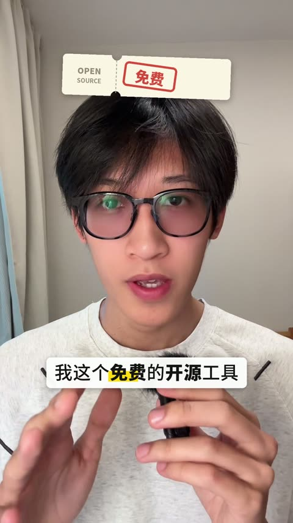](library/ticket-stamp/preview.mp4) | 一张票根卡掉落,两个印章依次盖下 | 强调"免费/开源"一类的资质/承诺信息 | `video20-a0-shots/src/a0shots.py:s04` | 视频20 · A0 |
| 文档卡滑入 (doc-card-slide-in) | [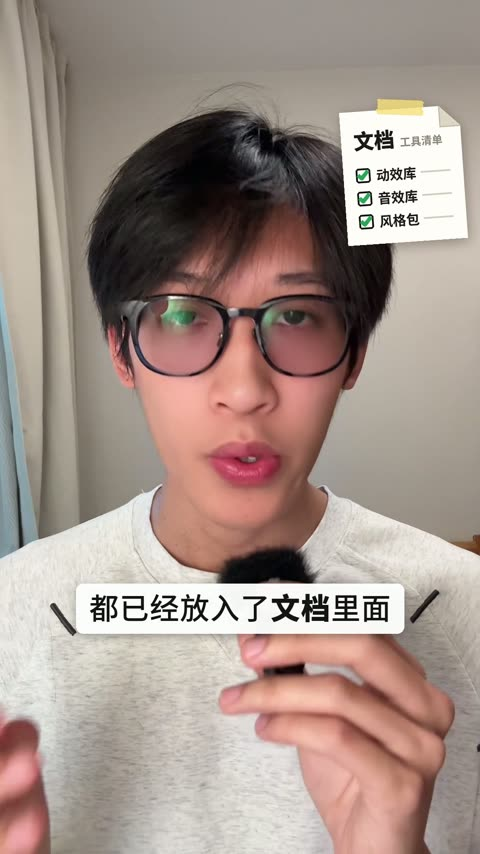](library/doc-card-slide-in/preview.mp4) | 一张清单卡片（打勾条目）从右上滑入停在出镜者身旁 | 列举"这次交付了什么"一类的清单 | `video20-a0-shots/src/a0shots.py:s05` | 视频20 · A0 |
| 大头贴开场 (photo-booth-intro) |  | 见 `components/ip_intro.js`——已是正式组件,本条目只是把它的输出剪进了这条视频的时间轴 | 固定的"我是谁"自我介绍开场 | `components/ip_intro.js` | 视频20（组件已迁移） |
| 成片讲解+右下人像框(含眼皮合上) (clip-narration-pip) | [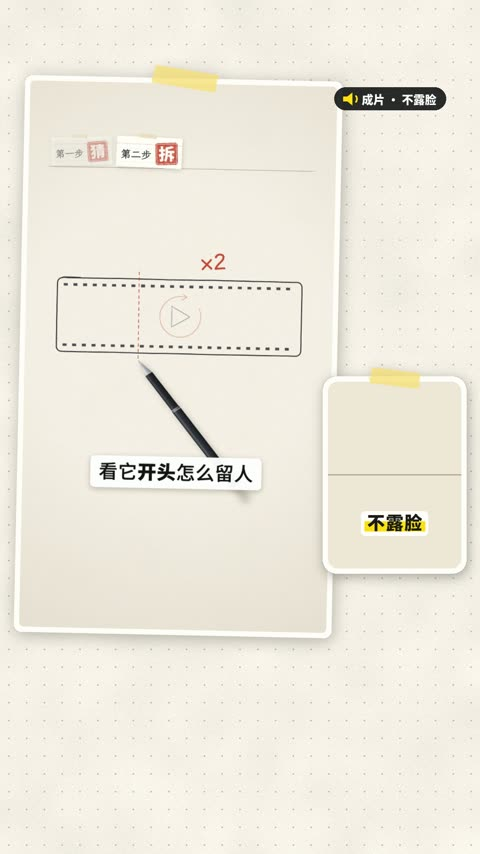](library/clip-narration-pip/preview.mp4) | 演示素材播放期间出镜者收进右下 PiP 持续讲解;其中一镜额外做了"眼皮"两片纸襟合上/弹开的动画 | 边讲解边放素材,同时不让人消失（"人物不消失"固定规则的范例） | `video20-a1-shots/src/explain.py`（`Shot07`/`Shot08`/`Shot09`） | 视频20 · A1 |
| 立体纸盒 (paper-box-3d) | [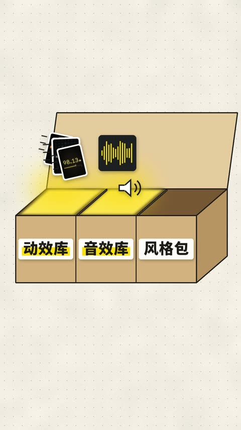](library/paper-box-3d/preview.mp4) | 三个素材缩略图飞入折叠成牛皮纸盒,再弹开成三格分类工具箱 | 把几个子功能/子模块归纳成"打开的工具箱"隐喻 | `video20-a1-shots/src/boxshots.py:Shot10` | 视频20 · A1 |
| 抛给Agent (toss-to-agent) |  | 一个盒子沿贝塞尔曲线被"抛"进一个状态从"接收中"变"已就绪"的卡片 | 表现"交给自动化/Agent 处理"的交接动作 | `video20-a1-shots/src/boxshots.py:Shot11` | 视频20 · A1 |
| 大号数字+步骤条 (big-number-stepper) |  | 大号数字砸入画面,配合步骤进度条出现 | 强调"第 N 步"或一个量化数字 | `video20-a0-shots/src/a0shots.py:s12` | 视频20 · A0 |
| 全屏对话框 (fullscreen-dialog) |  | 全屏聊天界面演出一段和 AI 的对话（带附件、拼音候选、打字动效),出镜者仍在右下 PiP | 演示"如何向 AI 下指令"这类交互过程 | `video20-a2-shots/src/shot13.py` | 视频20 · A2 |
| 风格速切+四宫格 (style-quick-cut-grid) |  | 整个画面按风格名一次次横扫切换,最后收进 2x2 宫格对比 | 展示"同一素材换多种风格"的对比效果 | `video20-a2-shots/src/shot14a2.py:Shot14a` | 视频20 · A2 |
| 风格刷 (style-brush) |  | 一把"刷子"扫过画面,扫过之处画风被替换 | 表现"一键换风格"的动作感 | `video20-a2-shots/src/shot14.py:Shot14.frame14b()` | 视频20 · A2 |
| 胶片灯箱 (film-lightbox) | [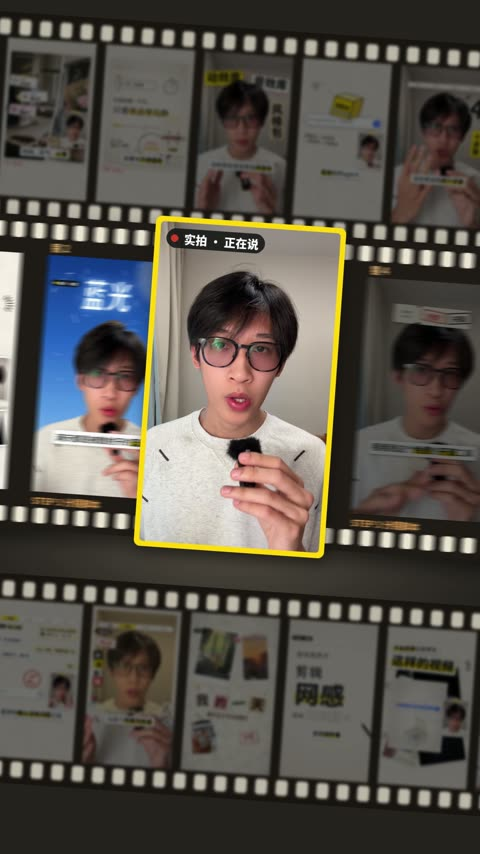](library/film-lightbox/preview.mp4) | 镜头拉远,画面变成放在胶片灯箱里的一格底片,再推回满屏 | 用"胶片"质感给一段实拍素材加相框、做入场/退场 | `video20-a3-shots/src/shot15.py` | 视频20 · A3 |
| 实拍自检含重做小卡 (live-selfcheck-redo) |  | 红色扫描线检查画面问题（如字幕压脸),标红定位、挪到安全区,或弹出"重新生成中"的重做卡片走完进度条 | 可视化"自动 QA 门禁"本身,呼应 SKILL 里"自检不过就重做"的规则 | `video20-a3-shots/src/shot16.py` | 视频20 · A3 |
| 回顾快闪 (recap-flash) |  | 出镜者再次收进 PiP,三段素材小卡快闪飞回,收尾贴一张"N 步"贴纸 | 视频中段/结尾的快速回顾 | `video20-a0-shots/src/a0shots.py:s17` | 视频20 · A0 |
| 左右分屏工作台 (split-screen-workbench) | [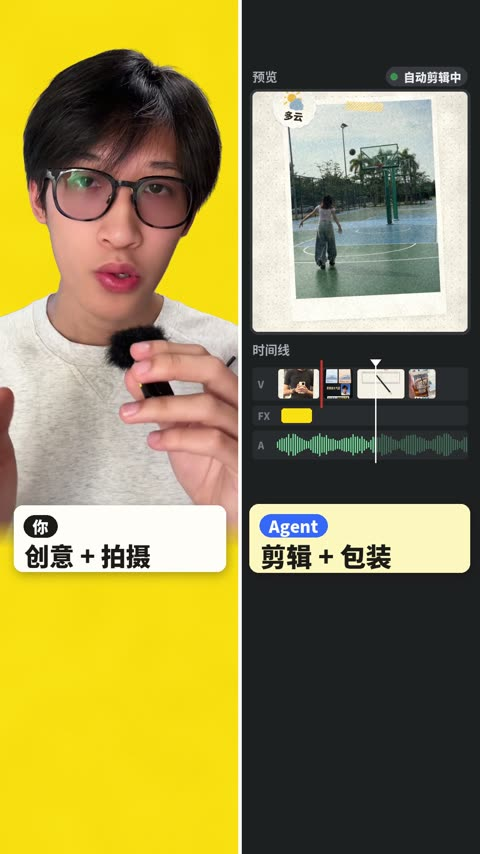](library/split-screen-workbench/preview.mp4) | 画面从中缝推开成左右分屏:左边是抠像出镜者+角色卡,右边是模拟剪辑工作台（时间线跳切、音频波形、功能 chip 依次弹入） | 表现"人和 Agent 分工协作"的画面语言 | `video20-a2-shots/src/shot18.py` | 视频20 · A2 |
| 版本贴纸+手绘曲线 (version-sticker-curve) |  | 版本号贴纸盖下,一条手绘曲线随讲解逐步画出 | 展示"迭代/成长曲线"一类的进展叙事 | `video20-a0-shots/src/a0shots.py:s19` | 视频20 · A0 |
| 片尾互动图标 (endcard-icons) | [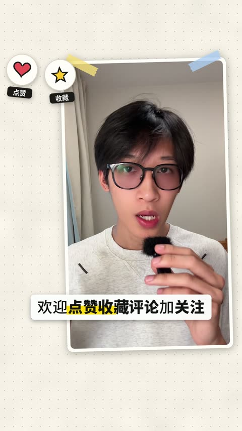](library/endcard-icons/preview.mp4) | 若干互动图标（点赞/收藏/关注等）依次弹出 | 片尾引导互动的标准收尾 | `video20-a0-shots/src/a0shots.py:s20` | 视频20 · A0 |

## 演示

三条按不同视觉风格专门制作的演示成片,每条选了几个代表性效果。

| 镜头名 | 预览 | 做法 | 适合场景 | 入口 | 来源 |
|---|---|---|---|---|---|
| 翻页转场 (page-turn-transition) | [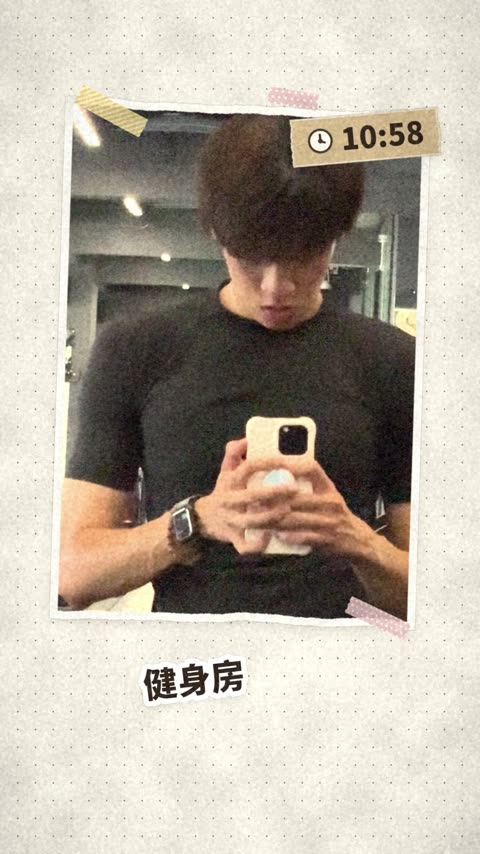](library/page-turn-transition/preview.mp4) | 围绕虚拟书脊的透视变形（`cv2.getPerspectiveTransform`+`warpPerspective`）+ 合成投影 | 两个素材片段之间的场景切换，模拟翻一页笔记本 | `library/_shared/vlog-collage-runtime/src/engine.py:trans_flip()` | demos/vlog |
| 拍立得 (polaroid-card) | [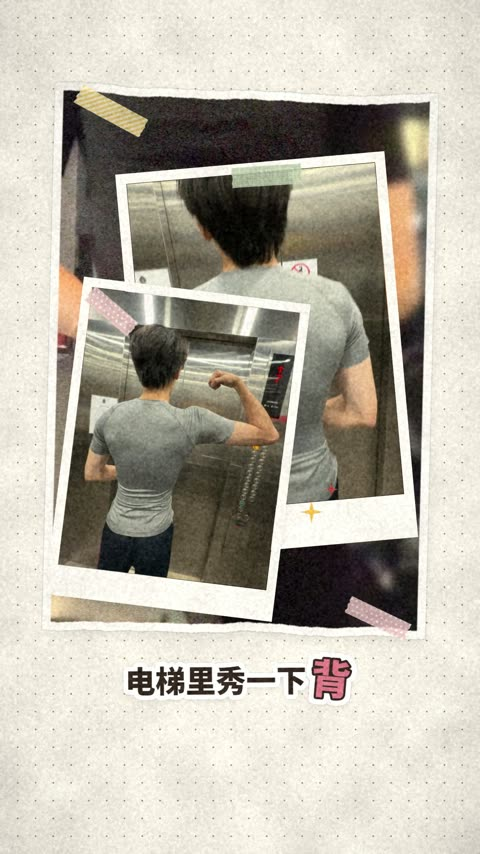](library/polaroid-card/preview.mp4) | 纸质相框精灵图 + 弹入落定动效，相框内嵌活视频 | 强调"这是一张照片/一个瞬间"的插入镜头 | `library/_shared/vlog-collage-runtime/src/vlog.py:b_polaroid()` | demos/vlog |
| 时间天气心情卡 (weather-mood-card) | [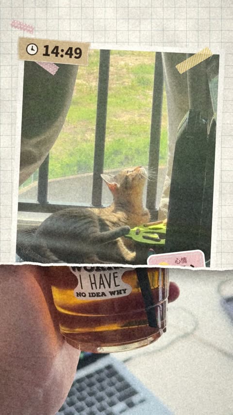](library/weather-mood-card/preview.mp4) | 三种卡片（时间/天气/心情）共用一个弹入-停留-弹出的调度器 | 日常 vlog 里穿插状态信息，不用口播交代 | `library/_shared/vlog-collage-runtime/src/vlog.py:card()` + `collage.py` | demos/vlog |
| 人后标题卡 (title-card-behind-person) |  | DOM 卡片在人像图层之后，弹簧入场 + 3D 旋转退场 | 出镜讲解开场，点题但不挡脸 | `library/_shared/kepu-scene-runtime/src/scene.js`（`R.cTitle`） | demos/kepu |
| 示意图生长 (diagram-grow) |  | 卡片入场 → 光束生长 → 若干节点逐个弹出（错峰 0.13s）→ 散射爆发 | 科普/原理讲解，把抽象概念画成一步步生长的示意图 | `library/_shared/kepu-scene-runtime/src/scene.js`（`buildScatter()`） | demos/kepu |
| 换背景加人后发光字 (bg-swap-glow-text) |  | 多层 `text-shadow` 叠出发光字（人后图层）；背景替换是另一套 Vision 抠像+净版合成，未随本条目打包 | 强调关键词时让文字"发光"，同时干净化背景 | `library/_shared/kepu-scene-runtime/src/scene.js`（`R.kwLanguang`） | demos/kepu |
| 笔画生长 (stroke-growth) |  | 折线重采样 + 手抖动扰动 + 压感式笔宽渐变，真正"画出来"而不是淡入 | 手绘感强调、标题书写、教程类分步骤讲解 | `library/_shared/faceless-paper-runtime/src/ink.js`（`Stroke`/`Drawing`/`Writing`） | demos/faceless |
| 索引卡盖章 (index-card-stamp) |  | 卡片状态机（掉落→落地→盖章→缩小成标签）+ 红色印章 multiply 混合 | 步骤/流程类内容的"完成确认"节点 | `library/_shared/faceless-paper-runtime/src/scene.js`（`Card` 类）+ `ink.js:makeStamp()` | demos/faceless |
| 步骤标签 (step-label) | [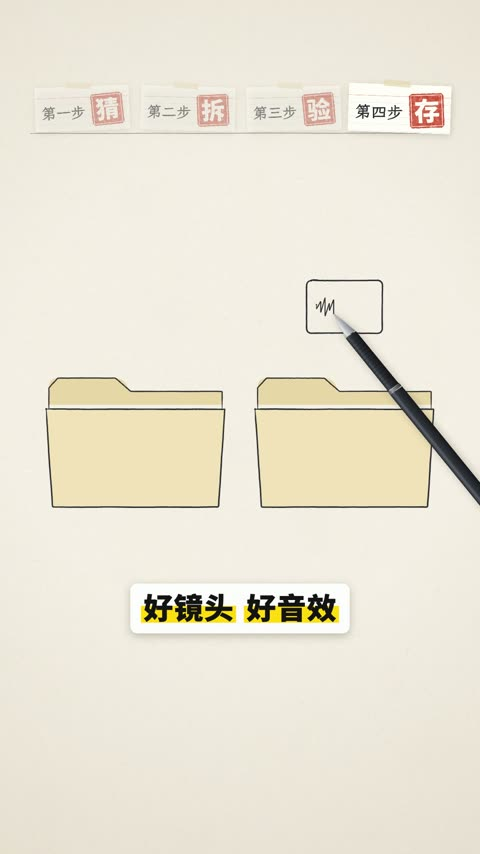](library/step-label/preview.mp4) | 卡片缩小飞到顶部槽位，旧标签随新标签到来而变暗 | 多步骤教程的进度回顾 | `library/_shared/faceless-paper-runtime/src/scene.js`（`Card` 类飞入槽位阶段） | demos/faceless |

## 创意短片《在我开口之前》

Claude 自主创作的 60 秒短片，代码驱动画面与配乐，可视化"AI 生成一个字"的过程。10 个场景共享一套渲染骨架，见 `library/_shared/creative-film-runtime/`。

| 镜头名 | 预览 | 做法 | 适合场景 | 入口 | 来源 |
|---|---|---|---|---|---|
| 切词 (word-cut) |  | 一连串扫过整行文字的刀光转场，逐次把一整行切成小块 | 表现"把连续输入切成离散单元"的第一步 | `library/_shared/creative-film-runtime/` + `library/word-cut/src/s23.js`（场景 S2 前段） | 《在我开口之前》 |
| 编号 (numbering) | [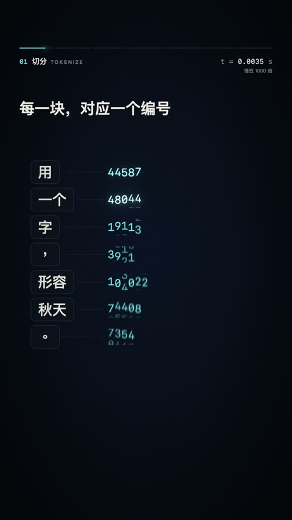](library/numbering/preview.mp4) | 切好的词飞入竖排卡片，随机数字滚动锁定成编号 | 表现"给每个片段分配一个 ID" | 同上，场景 S2 后段 | 《在我开口之前》 |
| 向量 (vector-embed) | [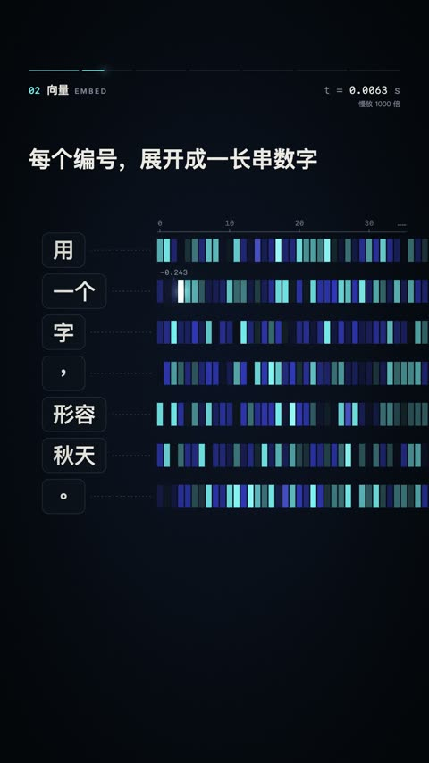](library/vector-embed/preview.mp4) | 每个编号展开成 42 格彩色热力条，再收缩成一个色点 | 表现"离散 ID 展开成一长串数字"（embedding 的直觉可视化） | 同上，场景 S3 | 《在我开口之前》 |
| 语义星空 (semantic-starfield) |  | 确定性 3D 词云（16 个主题簇），透视相机+景深+尘埃背景 | 表现"意思相近的概念在空间上也相近" | `library/semantic-starfield/src/s4.js`（场景 S4） | 《在我开口之前》 |
| 注意力连线 (attention-lines) | [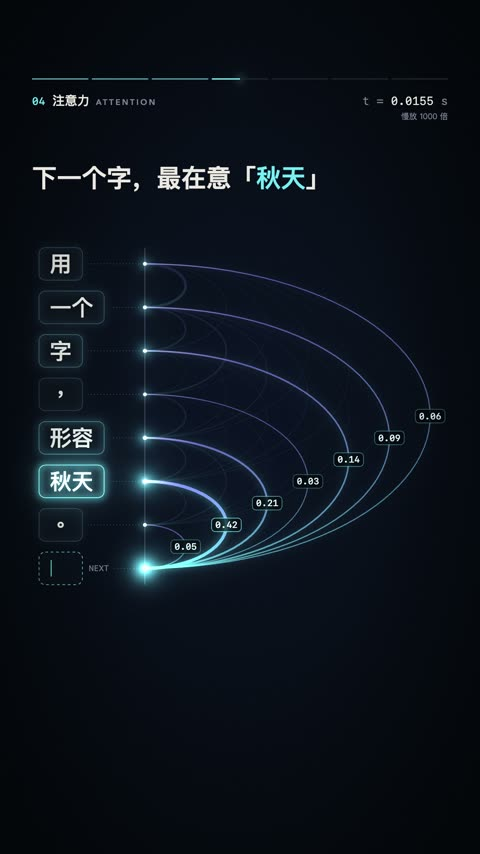](library/attention-lines/preview.mp4) | 从每个词到一个锚点的椭圆弧线，线宽/透明度映射权重，脉冲沿弧线走动 | 表现"每个元素对当前决策的贡献大小"，一种加权关系可视化 | `library/attention-lines/src/s56.js`（场景 S5） | 《在我开口之前》 |
| 层层计算 (layered-compute) | [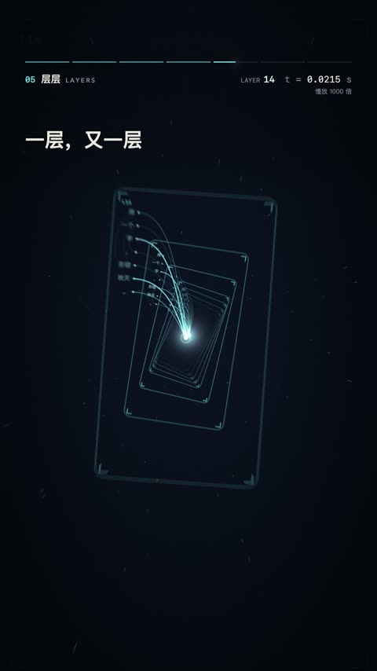](library/layered-compute/preview.mp4) | 26 块带纹理的 WebGL 平面组成隧道飞向镜头，每块重放一次小型连线图，结尾内爆+闪白 | 表现"信息经过很多层处理"，一种纵深堆叠的计算感 | `library/layered-compute/src/s56.js`（场景 S6） | 《在我开口之前》 |
| 打分 (scoring) |  | 候选字符网格被对角扫描线揭示，Top-8 飞出组成带百分比的排行榜 | 表现"给所有候选选项打分排序" | `library/scoring/src/s78.js`（场景 S7） | 《在我开口之前》 |
| 掷骰子 (dice-roll) | [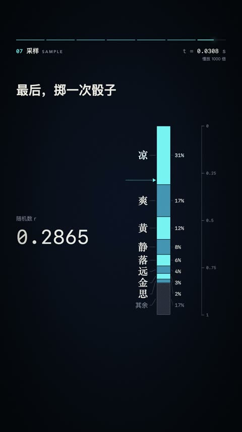](library/dice-roll/preview.mp4) | 排行榜转成累积概率柱，轮盘式随机数滚动锁定在某个区间 | 表现"按概率而不是取最大值来采样一个结果" | `library/dice-roll/src/s78.js`（场景 S8） | 《在我开口之前》 |
| 落字 (falling-text) |  | 选中的字从排行榜位置飞向屏幕中心，撞击瞬间渐变色+冲击环+全片最重的运动模糊 | 表现"计算结果终于落地"的高潮时刻 | `library/falling-text/src/s910.js`（场景 S9） | 《在我开口之前》 |
| 现场制造蒙太奇 (live-montage) |  | 剩余每个字逐个生成，每次重放 7 种视觉母题之一（刀光/热力条/星轨/弧扇/隧道/闪烁网格/概率柱），结尾盖红色印章 | 表现"同一个生成过程对后续每个字都重来一遍"，適合总结/回顾蒙太奇 | `library/live-montage/src/s910.js`（场景 S10） | 《在我开口之前》 |

后期与配乐已经从这部短片里泛化出去、不在上面 10 条目里重复：子帧运动模糊 + 双半径辉光 + 颗粒见 `engine/post.js`（逐主体的运动模糊辅助函数 `blurRing()` 见 `engine/core.js`）；代码合成配乐见 `audio/xlaudio/`（`audio/README.md` 有完整说明）；"粒子聚成文字"这个具体效果（采样文字轮廓 + 粒子飞向采样点）还没有做成任何一条 `library/` 演示,做法和伪代码见 `references/director.md`,可复用函数是 `engine/particles.js` 的 `textPoints()` + `converge()`。

## 全局组件

跨镜头复用的通用元件。同一个概念在库里可能有两种视觉语言的实现(一种来自这部创意短片、已经是 `components/` 下的正式组件；一种来自视频 20 的纸质手账风格、还是未整理的 Python 函数)——两者都列出,选哪个是风格取舍,不是对错问题。

| 组件 | 预览 | 做法 | 适合场景 | 入口 | 来源 |
|---|---|---|---|---|---|
| 关键词弹出 | 见 `word-cut`/`numbering` 等创意短片条目 | 逐字上浮+去模糊+淡入，错峰入场，可选高亮底 | 强调口播中的关键词 | `components/kinetic_keyword.js`（正式组件，"科技感" HUD 风格） | 《在我开口之前》（已迁移） |
| 关键词弹出（纸质版，待整理） | 见 `flash-card-hook` 等视频20条目 | 弹跳曲线 `pop_curve()` 驱动的字符级弹入 + 胶囊标签 `label()`/`vlabel()` | 纸质手账/贴纸风格的关键词强调 | `library/_shared/paper-craft-components/src/a0lib.py`（`pop_curve`）+ `sb_lib.py`（`label`/`vlabel`） | 视频20 |
| 章节铃 / 章节标签 | 见 `fullscreen-dialog`/`film-lightbox` 等视频20条目 | 分段 HUD 进度条 + 章节号/中英文标题，左到右擦入带扫描线；分镜写 `invert: true` 走反相混合（亮底变暗、暗底保持亮，中灰底失效，见 `references/director.md`） | 多章节讲解视频的进度指示 | `components/chapter_tag.js`（正式组件） | 《在我开口之前》（已迁移） |
| 步骤条（纸质版，待整理） | 见 `big-number-stepper` | 纸卡风格的步骤进度条，静态版 `step_bar()`，动画版 `step_bar_image()` | 纸质手账风格的多步骤指示 | `library/_shared/paper-craft-components/src/sb_lib.py`（`step_bar`）+ `a0lib.py`（`step_bar_image`） | 视频20 |
| 纸条字幕（待整理） | 见任意视频20条目 | 静态几何 `subtitle_c()`；生产/动画版（马克笔描边+关键词弹出）`strip_geometry()`/`strip_image()`/`strip_state()` | 比纯文字描边字幕更耐看的"贴纸条"字幕观感 | `library/_shared/paper-craft-components/src/sb_lib.py` + `a0lib.py` | 视频20 |
| 右下人像框（PiP，待整理） | 见 `clip-narration-pip` | 静态 `pip_crop()`/`pip_card()`/`add_pip()`；生产版（整帧变形收进画框）`pip_region()`/`pip_layer()` | 切到全屏图形时让真人不消失（"人物不消失"固定规则） | `library/_shared/paper-craft-components/src/sb_lib.py` + `a0lib.py` | 视频20 |
| 切刀扫描转场 | — | 刀线扫过+面板合拢的全屏遮罩转场，中点完全遮盖可藏底片剪切点 | 需要在转场中点藏一个剪辑点时 | `components/token_cut.js`（正式组件） | 《在我开口之前》（已迁移） |

"待整理"的纸质版组件目前只是从视频 20 生产代码里摘出来的函数，还没有包装成和 `components/*.js` 一样的参数化组件（`id`/`role`/`params`/`draw`/`bbox` 契约)；直接读函数源码来移植,不能像 `components/*.js` 那样即插即用。

## 全屏动效卡

早期试做过、后来在关机清空临时目录时丢失，2026-09-27 按最初的一句话描述重新实现的 7 张全屏卡。纯图形，不依赖任何真人素材；每条目录都自带 `src/build.py` + `src/<效果>.js` + 共享的 `src/shotkit.py`（渲染/合成/出片，11 条目全部相同，见 `library/_shared/rebuilt-shotkit/`）+ 本条目合成的音效（`src/sound.py`，无采样无音色库），可以直接 `cd library/<name>/src && python3 build.py render --out <目录>` 重渲。

| 镜头名 | 预览 | 做法 | 适合场景 | 入口 | 来源 |
|---|---|---|---|---|---|
| 活字印刷标题 (card-movable-type) | [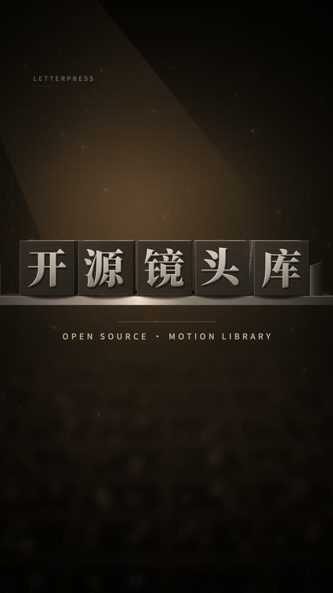](library/card-movable-type/preview.mp4) | 每个字是有体积的 3D 金属活字（透视相机+逐面打光），按阅读顺序依次升起、翻正、落进排字槽，楔子锁版，扫光后副标题聚焦出现 | 标题卡、章节开头，"开源/工具/排版"类主题 | `library/card-movable-type/src/movable_type.js` | 重建版，2026-09-27 |
| 汉字雨纠错 (card-hanzi-proof) |  | 三层景深的汉字雨落下变慢，一列停成成语；红笔圈出错字、划掉、手写改正、正确字滑入原位变成铅字，盖"校"印后雨继续落 | 纠错/校对、"AI 帮你检查"类主题，也可当慢下来聚焦的转场 | `library/card-hanzi-proof/src/hanzi_proof.js` | 重建版，2026-09-27 |
| 输入框下指令 (card-prompt-box) |  | 通用输入框逐字打出指令并回车，三样生成物依次飞进一个白色纸盒，停一拍后合盖打勾；画面无任何平台/产品样式或图标 | "一句话交给 AI"、提交需求到打包交付的流程示意 | `library/card-prompt-box/src/prompt_box.js` | 重建版，2026-09-27 |
| 时间线剪口 (card-timeline-cut) | [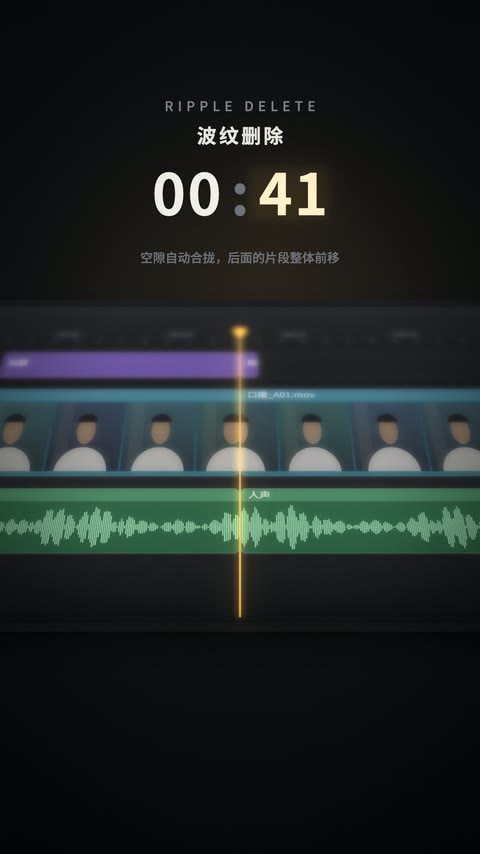](library/card-timeline-cut/preview.mp4) | 微距时间线上钢刀片切开入点/出点（火花+色散），中间片段翻转掉落，右侧片段左移合拢卡位（波纹删除），总时长读数滚动下降 | 讲剪辑、删废话、"自动剪掉停顿"类效率提升主题 | `library/card-timeline-cut/src/timeline_cut.js` | 重建版，2026-09-27 |
| 画框隧道 (card-frame-tunnel) |  | 一层层描金画框向深处排列并各多转 5°，镜头推进时画框逐层擦过镜头，最终停在最里层画布的聚焦标题上 | 章节转场、"进入下一部分"、作品集/展览类片头 | `library/card-frame-tunnel/src/frame_tunnel.js` | 重建版，2026-09-27 |
| 数字冲击 (card-number-impact) | [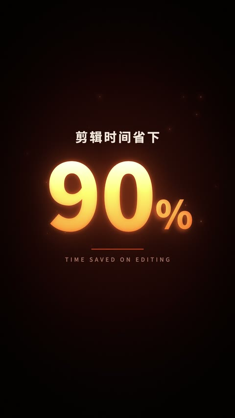](library/card-number-impact/preview.mp4) | 数字从 0 加速跳数并放大，速度线向中心汇聚，到达目标值时闪白+色散+冲击波环+火星四溅+镜头震动，辉光从炽白冷却成余烬 | 关键数据/结论强调，"提升 X 倍 / 省下 X%" | `library/card-number-impact/src/number_impact.js` | 重建版，2026-09-27 |
| 连线工作流 (card-flow-nodes) | [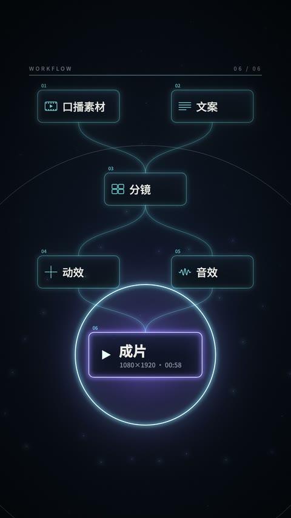](library/card-flow-nodes/preview.mp4) | 工作流节点按层依次亮起并连线，光点沿线流动到结果节点，结果节点圆环充能满圈后闪白扩散完成 | 讲流程、自动化、"一套东西串起来"的 AI 工作流 | `library/card-flow-nodes/src/flow_nodes.js` | 重建版，2026-09-27 |

## 真人融合镜头

同一批 2026-09-27 重建，另外 4 条：图形和真人合成在一起（Apple Vision 人像抠像/人脸/手部姿态追踪），素材取自作者本人已发布视频的锁定母版，人物像素本身不做调色改动。共享的 Vision 探针与逐帧素材读取见 `library/_shared/rebuilt-fusion-runtime/`；每条 README 都记录了具体取用的帧范围、原话，以及肤色色差和 `qa.pixel_qa` 的核验结果。**这 4 条的预览/缩略图里出现真人（作者本人）是有意的——效果本身就是"图形与真人合成"，且素材经作者本人同意公开。**

| 镜头名 | 预览 | 做法 | 适合场景 | 入口 | 来源 |
|---|---|---|---|---|---|
| 字在人后 (fusion-word-behind) |  | Vision 逐帧抠像+背景补全，词落在人物身后一层，说到这个词时对焦落定，随后墙/字/人三层按不同速度推近形成视差 | 口播关键词、标题式强调、杂志封面感的强调用法 | `library/fusion-word-behind/src/word_behind.js` | 重建版，2026-09-27 |
| 穿进录屏 (fusion-screen-pip) | [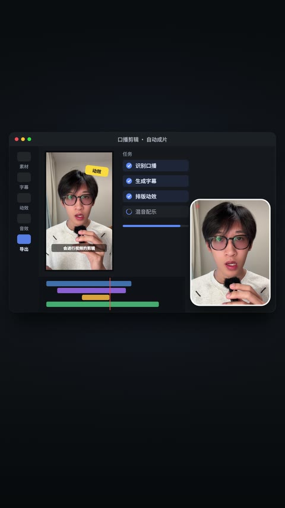](library/fusion-screen-pip/preview.mp4) | 人脸追踪取景，真人从全屏缩成圆角小窗，再飞进一个通用录屏界面落位到主播小窗位，随后界面开始工作（加载/打勾/时间线） | 讲工具、演示操作、从真人转到录屏演示的衔接镜头 | `library/fusion-screen-pip/src/screen_pip.js` | 重建版，2026-09-27 |
| 活字扫描 (fusion-type-scan) | [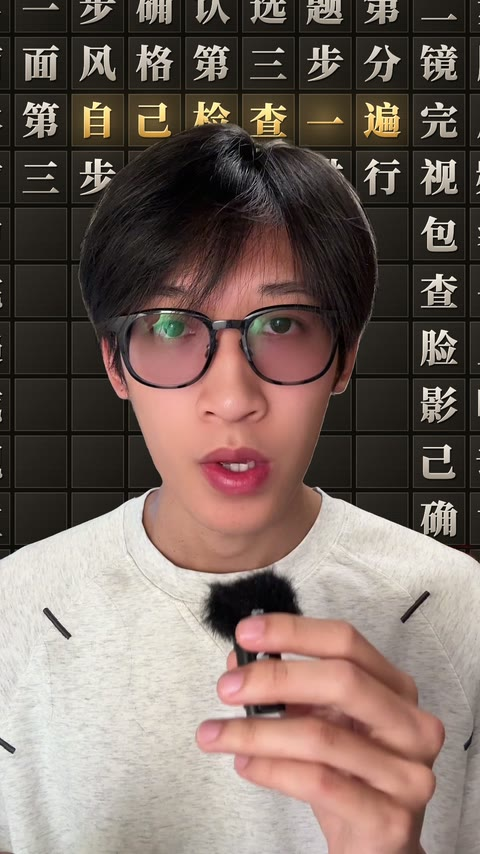](library/fusion-type-scan/preview.mp4) | 人物身后的墙被扫描线逐步换成排满活字的版面（字取自本条视频文案），第二道更亮的检查扫描线经过时活字翻面露出新字 | "检查/扫描/审核/排版"类口播，人物站定、背景干净的镜头 | `library/fusion-type-scan/src/type_scan.js` | 重建版，2026-09-27 |
| 手势抛字 (fusion-hand-throw) |  | Vision 手部姿态追踪捕捉挥手动作，每说一个词就跟手甩出、沿弧线飞到头部一侧贴住，各自样式对应它所指代的风格 | 口播里的列举/清单，"把 A 丢给 B"类动作强调 | `library/fusion-hand-throw/src/hand_throw.js` | 重建版，2026-09-27 |
